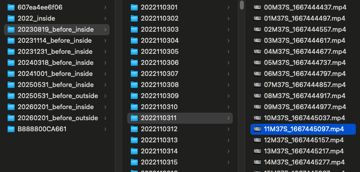

# 12T 硬盘告急！我写了个 AI 抓“鬼”，把监控视频里的无人片段全删了

家里有娃之后，安全感成了刚需。

为了随时能看到孩子，也为了阿姨在家带娃时多一份安心，我把家里的监控武装到了牙齿。作为一个稍微懂点技术的理工男，由于不放心把家庭隐私视频传到云端，我选择了一个更极客的方案：**视频存本地 NAS (类似私有的百度网盘)**。

本以为有了 12T 的超大硬盘，我可以高枕无忧地存个几年。万万没想到，**仅仅过了1-2年，我的 NAS 就开始红灯报警——存储空间满了！**

### 谁“吃”了我的硬盘？

我打开文件夹一看，好家伙，密密麻麻的视频文件，甚至能把电脑卡死!

现在的摄像头虽然都有“移动侦测”功能（只在画面有动静时录像），但这个功能实在是**太！笨！了！**

只要画面里有一丁点像素变化，它就开始疯狂录制：

*   一只**蚊子**飞过镜头……录！存下来！
*   **扫地机器人**准时出来工作……录！存下来！
*   窗外树影晃动，或者光线变暗了……录！存下来！

我的 12T 硬盘里，存的不仅有孩子的欢笑，还有大量的“电子垃圾”。

### 既然现成的不好用，那就自己造！

作为一个爱折腾的 AI 程序员，我决定发起反击。我不需要更贵的硬盘，我需要更聪明的“眼睛”。

于是，我利用周末时间，和 Claude Code 配合开发了一个基于 AI 的小工具。我的核心诉求只有一个：**只保留“含人量” 100% 的视频。**

### 效果：瘦身成功！

程序跑了一晚上，对着我 NAS 里囤积的视频库一顿输出。

结果令人极度舒适：**硬盘空间瞬间释放了 50% 以上！** 那些长达几小时的“扫地机工作实录”和“午夜蚊子飞舞”统统消失了，剩下的全是有家人出现的有效片段。

不仅省了买新硬盘的钱，现在我回看视频时，每一秒都是有效信息，再也不用手动拖进度条了。

### 开源分享

独乐乐不如众乐乐。我知道肯定有很多像我一样，家里装了监控、买了 NAS，却被垃圾视频塞满硬盘的朋友。

我已经将这个工具的核心代码开源到了 GitHub。

https://github.com/MorvanZhou/find-human-video

如果你是懂点代码的极客，或者想学习怎么用 Python 玩转 YOLO 模型，欢迎去我的主页看看，顺便点个 Star ⭐️。

### 写在最后

目前这个工具还是一个需要懂点 Python 代码的小项目，对于不会编程的朋友来说，使用门槛确实有点高，需要自己配置环境、跑脚本。

**但是！**

如果这篇文章如果有**超过 300 的转发**（或者大家在评论区呼声够高），我就知道这确实是 **大家的痛点**。

**我会考虑把它打包成一个傻瓜式的桌面软件（App）！**

